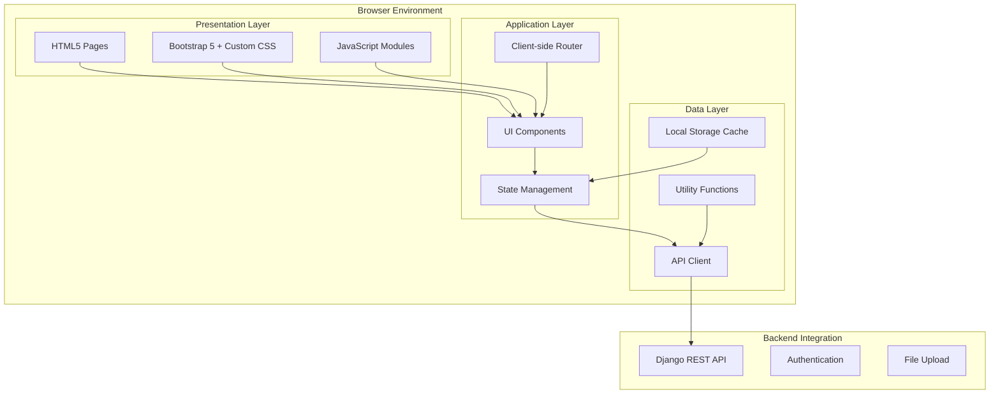
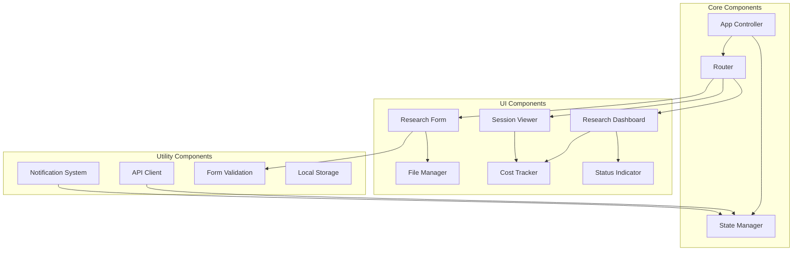
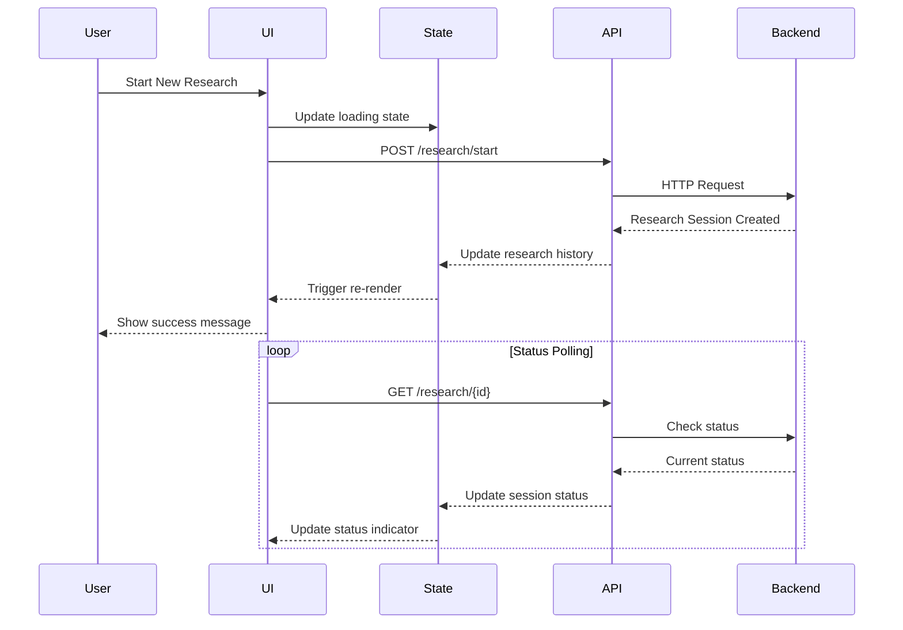

# Design Document: AI Research Frontend

## Overview

The AI Research Frontend is a modern, responsive single-page application (SPA) built with HTML5, CSS3, Bootstrap 5, and vanilla JavaScript. It provides an intuitive interface for the AI Research System, enabling users to manage research sessions, upload context files, monitor progress, and view results. The design emphasizes clean UI/UX, real-time feedback, and seamless integration with the existing Django REST API.

The frontend follows a component-based architecture using vanilla JavaScript modules, ensuring maintainability while avoiding heavy framework dependencies. Bootstrap provides the responsive foundation, while custom CSS enhances the user experience with modern design patterns and smooth interactions.

## Architecture

### Frontend Architecture



### Component Structure



## Components and Interfaces

### HTML Structure

**Main Layout (index.html)**
```html
<!DOCTYPE html>
<html lang="en">
<head>
    <meta charset="UTF-8">
    <meta name="viewport" content="width=device-width, initial-scale=1.0">
    <title>AI Research System</title>
    <link href="https://cdn.jsdelivr.net/npm/bootstrap@5.3.0/dist/css/bootstrap.min.css" rel="stylesheet">
    <link href="https://cdn.jsdelivr.net/npm/bootstrap-icons@1.10.0/font/bootstrap-icons.css" rel="stylesheet">
    <link href="css/styles.css" rel="stylesheet">
</head>
<body>
    <!-- Navigation -->
    <nav class="navbar navbar-expand-lg navbar-dark bg-primary">
        <div class="container">
            <a class="navbar-brand" href="#dashboard">
                <i class="bi bi-search"></i> AI Research System
            </a>
            <div class="navbar-nav ms-auto">
                <a class="nav-link" href="#dashboard">Dashboard</a>
                <a class="nav-link" href="#new-research">New Research</a>
            </div>
        </div>
    </nav>

    <!-- Main Content -->
    <main class="container-fluid py-4">
        <div id="app-content">
            <!-- Dynamic content loaded here -->
        </div>
    </main>

    <!-- Notification Container -->
    <div id="notification-container" class="position-fixed top-0 end-0 p-3" style="z-index: 1050;"></div>

    <!-- Loading Overlay -->
    <div id="loading-overlay" class="d-none">
        <div class="spinner-border text-primary" role="status">
            <span class="visually-hidden">Loading...</span>
        </div>
    </div>

    <script src="https://cdn.jsdelivr.net/npm/bootstrap@5.3.0/dist/js/bootstrap.bundle.min.js"></script>
    <script type="module" src="js/app.js"></script>
</body>
</html>
```

### CSS Architecture

**Custom Styles (css/styles.css)**
```css
/* CSS Custom Properties for theming */
:root {
    --primary-color: #0d6efd;
    --secondary-color: #6c757d;
    --success-color: #198754;
    --warning-color: #ffc107;
    --danger-color: #dc3545;
    --info-color: #0dcaf0;
    --light-color: #f8f9fa;
    --dark-color: #212529;
    
    --border-radius: 0.375rem;
    --box-shadow: 0 0.125rem 0.25rem rgba(0, 0, 0, 0.075);
    --transition: all 0.15s ease-in-out;
}

/* Global Styles */
body {
    font-family: 'Segoe UI', Tahoma, Geneva, Verdana, sans-serif;
    background-color: var(--light-color);
}

/* Loading Overlay */
#loading-overlay {
    position: fixed;
    top: 0;
    left: 0;
    width: 100%;
    height: 100%;
    background: rgba(255, 255, 255, 0.8);
    display: flex;
    justify-content: center;
    align-items: center;
    z-index: 9999;
}

/* Research Session Cards */
.research-card {
    transition: var(--transition);
    border: 1px solid #dee2e6;
    border-radius: var(--border-radius);
    box-shadow: var(--box-shadow);
}

.research-card:hover {
    transform: translateY(-2px);
    box-shadow: 0 0.5rem 1rem rgba(0, 0, 0, 0.15);
}

/* Status Badges */
.status-badge {
    font-size: 0.75rem;
    padding: 0.25rem 0.5rem;
    border-radius: 1rem;
}

/* File Upload Area */
.file-drop-zone {
    border: 2px dashed #dee2e6;
    border-radius: var(--border-radius);
    padding: 2rem;
    text-align: center;
    transition: var(--transition);
    cursor: pointer;
}

.file-drop-zone:hover,
.file-drop-zone.dragover {
    border-color: var(--primary-color);
    background-color: rgba(13, 110, 253, 0.05);
}

/* Progress Bars */
.progress-animated {
    background: linear-gradient(45deg, transparent 25%, rgba(255,255,255,.15) 25%, rgba(255,255,255,.15) 50%, transparent 50%, transparent 75%, rgba(255,255,255,.15) 75%, rgba(255,255,255,.15));
    background-size: 1rem 1rem;
    animation: progress-bar-stripes 1s linear infinite;
}

@keyframes progress-bar-stripes {
    0% { background-position: 1rem 0; }
    100% { background-position: 0 0; }
}

/* Research Report Styling */
.research-report {
    background: white;
    border-radius: var(--border-radius);
    padding: 1.5rem;
    box-shadow: var(--box-shadow);
}

.research-report h1, .research-report h2, .research-report h3 {
    color: var(--dark-color);
    margin-top: 1.5rem;
    margin-bottom: 1rem;
}

.research-report p {
    line-height: 1.6;
    margin-bottom: 1rem;
}

/* Cost Display */
.cost-display {
    background: linear-gradient(135deg, #667eea 0%, #764ba2 100%);
    color: white;
    border-radius: var(--border-radius);
    padding: 1rem;
}

/* Responsive Design */
@media (max-width: 768px) {
    .container-fluid {
        padding-left: 1rem;
        padding-right: 1rem;
    }
    
    .research-card {
        margin-bottom: 1rem;
    }
    
    .file-drop-zone {
        padding: 1rem;
    }
}

/* Dark Mode Support */
@media (prefers-color-scheme: dark) {
    :root {
        --light-color: #212529;
        --dark-color: #f8f9fa;
    }
    
    body {
        background-color: var(--dark-color);
        color: var(--light-color);
    }
}
```

### JavaScript Architecture

**Main Application Controller (js/app.js)**
```javascript
import { Router } from './router.js';
import { StateManager } from './state.js';
import { APIClient } from './api.js';
import { NotificationSystem } from './notifications.js';

class App {
    constructor() {
        this.state = new StateManager();
        this.api = new APIClient();
        this.notifications = new NotificationSystem();
        this.router = new Router();
        
        this.init();
    }
    
    async init() {
        // Initialize application
        await this.loadInitialData();
        this.setupEventListeners();
        this.router.init();
    }
    
    async loadInitialData() {
        try {
            // Load user's research history
            const history = await this.api.getResearchHistory();
            this.state.setResearchHistory(history);
        } catch (error) {
            this.notifications.showError('Failed to load research history');
        }
    }
    
    setupEventListeners() {
        // Global error handling
        window.addEventListener('unhandledrejection', (event) => {
            this.notifications.showError('An unexpected error occurred');
            console.error('Unhandled promise rejection:', event.reason);
        });
        
        // Network status monitoring
        window.addEventListener('online', () => {
            this.notifications.showSuccess('Connection restored');
        });
        
        window.addEventListener('offline', () => {
            this.notifications.showWarning('Connection lost - working offline');
        });
    }
}

// Initialize app when DOM is ready
document.addEventListener('DOMContentLoaded', () => {
    window.app = new App();
});
```

**API Client (js/api.js)**
```javascript
export class APIClient {
    constructor() {
        this.baseURL = '/api';
        this.defaultHeaders = {
            'Content-Type': 'application/json',
            'X-Requested-With': 'XMLHttpRequest'
        };
    }
    
    async request(endpoint, options = {}) {
        const url = `${this.baseURL}${endpoint}`;
        const config = {
            headers: { ...this.defaultHeaders, ...options.headers },
            ...options
        };
        
        try {
            const response = await fetch(url, config);
            
            if (!response.ok) {
                throw new Error(`HTTP ${response.status}: ${response.statusText}`);
            }
            
            const contentType = response.headers.get('content-type');
            if (contentType && contentType.includes('application/json')) {
                return await response.json();
            }
            
            return await response.text();
        } catch (error) {
            console.error('API request failed:', error);
            throw error;
        }
    }
    
    // Research API methods
    async startResearch(query, parentResearchId = null) {
        return this.request('/research/start', {
            method: 'POST',
            body: JSON.stringify({
                query,
                parent_research_id: parentResearchId
            })
        });
    }
    
    async getResearchHistory() {
        return this.request('/research/history');
    }
    
    async getResearchDetails(researchId) {
        return this.request(`/research/${researchId}`);
    }
    
    async continueResearch(researchId, query) {
        return this.request(`/research/${researchId}/continue`, {
            method: 'POST',
            body: JSON.stringify({ query })
        });
    }
    
    async uploadFile(researchId, file, onProgress = null) {
        const formData = new FormData();
        formData.append('file', file);
        
        return new Promise((resolve, reject) => {
            const xhr = new XMLHttpRequest();
            
            if (onProgress) {
                xhr.upload.addEventListener('progress', (e) => {
                    if (e.lengthComputable) {
                        const percentComplete = (e.loaded / e.total) * 100;
                        onProgress(percentComplete);
                    }
                });
            }
            
            xhr.addEventListener('load', () => {
                if (xhr.status >= 200 && xhr.status < 300) {
                    resolve(JSON.parse(xhr.responseText));
                } else {
                    reject(new Error(`Upload failed: ${xhr.statusText}`));
                }
            });
            
            xhr.addEventListener('error', () => {
                reject(new Error('Upload failed'));
            });
            
            xhr.open('POST', `${this.baseURL}/research/${researchId}/upload`);
            xhr.send(formData);
        });
    }
}
```

### Component Interfaces

**Research Dashboard Component**
```javascript
export class ResearchDashboard {
    constructor(container, state, api) {
        this.container = container;
        this.state = state;
        this.api = api;
        this.searchQuery = '';
        this.statusFilter = 'all';
        this.dateFilter = null;
    }
    
    render() {
        const sessions = this.getFilteredSessions();
        
        this.container.innerHTML = `
            <div class="row">
                <div class="col-12">
                    <div class="d-flex justify-content-between align-items-center mb-4">
                        <h1>Research Dashboard</h1>
                        <a href="#new-research" class="btn btn-primary">
                            <i class="bi bi-plus-circle"></i> New Research
                        </a>
                    </div>
                </div>
            </div>
            
            <!-- Search and Filters -->
            <div class="row mb-4">
                <div class="col-md-6">
                    <input type="text" class="form-control" placeholder="Search research sessions..." 
                           id="search-input" value="${this.searchQuery}">
                </div>
                <div class="col-md-3">
                    <select class="form-select" id="status-filter">
                        <option value="all">All Status</option>
                        <option value="PENDING">Pending</option>
                        <option value="PROCESSING">Processing</option>
                        <option value="COMPLETED">Completed</option>
                        <option value="FAILED">Failed</option>
                    </select>
                </div>
                <div class="col-md-3">
                    <input type="date" class="form-control" id="date-filter" 
                           placeholder="Filter by date">
                </div>
            </div>
            
            <!-- Research Sessions -->
            <div class="row" id="sessions-container">
                ${sessions.map(session => this.renderSessionCard(session)).join('')}
            </div>
            
            ${sessions.length === 0 ? this.renderEmptyState() : ''}
        `;
        
        this.setupEventListeners();
        this.startStatusPolling();
    }
    
    renderSessionCard(session) {
        const statusClass = this.getStatusClass(session.status);
        const timeAgo = this.formatTimeAgo(session.created_at);
        
        return `
            <div class="col-lg-4 col-md-6 mb-4">
                <div class="card research-card h-100" data-session-id="${session.id}">
                    <div class="card-header d-flex justify-content-between align-items-center">
                        <span class="badge status-badge bg-${statusClass}">${session.status}</span>
                        <small class="text-muted">${timeAgo}</small>
                    </div>
                    <div class="card-body">
                        <h6 class="card-title">${this.truncateText(session.query, 100)}</h6>
                        <p class="card-text text-muted">
                            ${session.summary ? this.truncateText(session.summary, 150) : 'No summary available'}
                        </p>
                        ${session.cost ? `
                            <div class="d-flex justify-content-between text-sm">
                                <span>Tokens: ${session.cost.total_tokens}</span>
                                <span>Cost: $${session.cost.estimated_cost}</span>
                            </div>
                        ` : ''}
                    </div>
                    <div class="card-footer">
                        <div class="btn-group w-100" role="group">
                            <a href="#research/${session.id}" class="btn btn-outline-primary btn-sm">
                                <i class="bi bi-eye"></i> View
                            </a>
                            ${session.status === 'COMPLETED' ? `
                                <button class="btn btn-outline-secondary btn-sm continue-btn" 
                                        data-session-id="${session.id}">
                                    <i class="bi bi-arrow-right-circle"></i> Continue
                                </button>
                            ` : ''}
                        </div>
                    </div>
                </div>
            </div>
        `;
    }
}
```

## Data Models

### Frontend State Management

```javascript
export class StateManager {
    constructor() {
        this.state = {
            researchHistory: [],
            currentSession: null,
            user: null,
            loading: false,
            error: null,
            filters: {
                search: '',
                status: 'all',
                dateRange: null
            }
        };
        
        this.subscribers = [];
    }
    
    subscribe(callback) {
        this.subscribers.push(callback);
        return () => {
            this.subscribers = this.subscribers.filter(sub => sub !== callback);
        };
    }
    
    setState(updates) {
        this.state = { ...this.state, ...updates };
        this.notifySubscribers();
        this.saveToLocalStorage();
    }
    
    getState() {
        return { ...this.state };
    }
    
    notifySubscribers() {
        this.subscribers.forEach(callback => callback(this.state));
    }
    
    saveToLocalStorage() {
        try {
            localStorage.setItem('aiResearchState', JSON.stringify({
                filters: this.state.filters,
                user: this.state.user
            }));
        } catch (error) {
            console.warn('Failed to save state to localStorage:', error);
        }
    }
    
    loadFromLocalStorage() {
        try {
            const saved = localStorage.getItem('aiResearchState');
            if (saved) {
                const parsed = JSON.parse(saved);
                this.setState(parsed);
            }
        } catch (error) {
            console.warn('Failed to load state from localStorage:', error);
        }
    }
}
```

### Data Flow Patterns



## Correctness Properties

*A property is a characteristic or behavior that should hold true across all valid executions of a system—essentially, a formal statement about what the system should do. Properties serve as the bridge between human-readable specifications and machine-verifiable correctness guarantees.*

### Property 1: Dashboard Data Display
*For any* research session data loaded into the dashboard, the system should display all required elements including status, query preview, and timestamps for each session.
**Validates: Requirements 1.1**

### Property 2: Research Form Interaction
*For any* user interaction with the "Start New Research" button, the system should display the research form with query input and file upload functionality.
**Validates: Requirements 1.2**

### Property 3: API Integration and Feedback
*For any* research query submission, the system should call the correct API endpoint and provide immediate user feedback about the submission status.
**Validates: Requirements 1.3**

### Property 4: Session Detail Navigation
*For any* research session clicked by a user, the system should display complete session details including report, summary, and reasoning information.
**Validates: Requirements 1.4**

### Property 5: Real-time Status Updates
*For any* research session in processing status, the system should poll for status updates and reflect changes in the status indicator.
**Validates: Requirements 1.5, 4.1, 4.2**

### Property 6: File Upload Validation
*For any* file uploaded by a user, the system should validate file type and size constraints before allowing the upload to proceed.
**Validates: Requirements 2.2**

### Property 7: Upload Progress Display
*For any* file upload operation, the system should show progress indicators and call the correct upload API endpoint.
**Validates: Requirements 2.3, 8.4**

### Property 8: File Processing Status Display
*For any* completed file upload, the system should display file metadata including name, size, and processing status.
**Validates: Requirements 2.4**

### Property 9: Continuation Button Visibility
*For any* research session with completed status, the system should display a "Continue Research" button, and hide it for sessions with other statuses.
**Validates: Requirements 3.1**

### Property 10: Research Continuation API Integration
*For any* research continuation request, the system should call the correct continuation API endpoint with the new query and parent session ID.
**Validates: Requirements 3.3**

### Property 11: Research Lineage Display
*For any* research session that is part of a continuation chain, the system should display the relationship between parent and child sessions.
**Validates: Requirements 3.4, 3.5**

### Property 12: Multi-session Status Tracking
*For any* dashboard view with multiple active research sessions, the system should display current status for all sessions simultaneously.
**Validates: Requirements 4.4**

### Property 13: Visual Status Indicators
*For any* research session status, the system should use appropriate visual indicators (progress bars, spinners, badges) to communicate the status clearly.
**Validates: Requirements 4.5**

### Property 14: Cost Data Display
*For any* research session with cost data, the system should display input tokens, output tokens, and estimated cost information.
**Validates: Requirements 5.1**

### Property 15: Cost Aggregation
*For any* user's research history, the system should calculate and display total costs and token usage across all sessions.
**Validates: Requirements 5.2**

### Property 16: Cost Formatting Consistency
*For any* cost information displayed, the system should format amounts with consistent currency symbols and decimal precision.
**Validates: Requirements 5.5**

### Property 17: Responsive Layout Adaptation
*For any* screen size or device type, the system should adapt layouts using Bootstrap responsive grid system and maintain usability.
**Validates: Requirements 6.1, 6.2**

### Property 18: Accessibility Compliance
*For any* user interface element, the system should provide proper focus indicators, tab order, and meet WCAG 2.1 AA standards.
**Validates: Requirements 6.3, 6.4**

### Property 19: Loading State Display
*For any* data loading operation, the system should show appropriate loading states and skeleton screens to indicate progress.
**Validates: Requirements 6.5**

### Property 20: Error Message Display
*For any* API failure or error condition, the system should display user-friendly error messages with suggested actions.
**Validates: Requirements 7.1, 7.4**

### Property 21: Network Error Handling
*For any* network connectivity loss, the system should detect the condition and notify users with retry options.
**Validates: Requirements 7.2**

### Property 22: Form Validation Feedback
*For any* form submission with invalid data, the system should highlight invalid fields with clear error messages.
**Validates: Requirements 7.3**

### Property 23: Notification Consistency
*For any* user feedback scenario, the system should use consistent notification patterns (alerts, toasts, modals) throughout the application.
**Validates: Requirements 7.5**

### Property 24: Navigation State Persistence
*For any* navigation between views, the system should maintain application state and provide smooth transitions.
**Validates: Requirements 8.2**

### Property 25: Large Content Optimization
*For any* large research report or content display, the system should implement pagination or lazy loading to maintain performance.
**Validates: Requirements 8.3**

### Property 26: Local Data Caching
*For any* research data retrieved from the API, the system should cache data locally to reduce redundant API calls and improve responsiveness.
**Validates: Requirements 8.5**

### Property 27: Real-time Search Filtering
*For any* search input in the dashboard, the system should filter research sessions in real-time as the user types.
**Validates: Requirements 9.1, 9.2**

### Property 28: Status Filter Functionality
*For any* status filter selection, the system should show only research sessions matching the selected status.
**Validates: Requirements 9.3**

### Property 29: Date Range Filtering
*For any* date range filter applied, the system should show only research sessions within the specified date range.
**Validates: Requirements 9.4**

### Property 30: Filter State Persistence
*For any* filter applied on the dashboard, the system should maintain filter state when navigating away and returning to the dashboard.
**Validates: Requirements 9.5**

### Property 31: Semantic HTML Structure
*For any* page or component, the system should use HTML5 semantic elements for proper document structure and accessibility.
**Validates: Requirements 10.1**

### Property 32: Bootstrap Framework Usage
*For any* UI component or layout, the system should use Bootstrap 5.x classes correctly and consistently.
**Validates: Requirements 10.2**

### Property 33: Vanilla JavaScript Implementation
*For any* JavaScript functionality, the system should use vanilla JavaScript or minimal libraries without heavy framework dependencies.
**Validates: Requirements 10.3**

### Property 34: Separation of Concerns
*For any* application code, the system should maintain proper separation between HTML, CSS, and JavaScript files.
**Validates: Requirements 10.4**

### Property 35: Modern JavaScript Features
*For any* JavaScript code, the system should use modern ES6+ features including async/await and fetch API for clean, maintainable code.
**Validates: Requirements 10.5**

### Property 36: Static File Deployment
*For any* deployment scenario, the system should function correctly as static files served by any web server without server-side dependencies.
**Validates: Requirements 10.6**

## Error Handling

### API Error Handling
- **Network Failures**: Automatic retry with exponential backoff, offline mode detection
- **HTTP Errors**: User-friendly error messages mapped from HTTP status codes
- **Timeout Handling**: Configurable request timeouts with user notification
- **Rate Limiting**: Graceful handling of API rate limits with retry suggestions

### File Upload Error Handling
- **File Type Validation**: Clear error messages for unsupported file types
- **Size Limit Enforcement**: Progress indication and size limit warnings
- **Upload Failures**: Retry mechanisms with progress restoration
- **Processing Errors**: Clear feedback on file processing failures

### Form Validation Error Handling
- **Real-time Validation**: Immediate feedback on form field validation
- **Required Field Highlighting**: Visual indicators for missing required fields
- **Input Format Validation**: Clear guidance for expected input formats
- **Submission Error Recovery**: Form state preservation on submission failures

### State Management Error Handling
- **Local Storage Failures**: Graceful degradation when local storage is unavailable
- **State Corruption**: Automatic state reset with user notification
- **Memory Management**: Cleanup of unused data to prevent memory leaks
- **Concurrent Updates**: Conflict resolution for simultaneous state changes

## Testing Strategy

### Dual Testing Approach
The frontend requires both unit testing and property-based testing to ensure comprehensive coverage:

**Unit Tests**: Verify specific examples, edge cases, and error conditions
- Component rendering with specific data sets
- Event handler functionality and DOM manipulation
- API client methods with mocked responses
- Form validation with known invalid inputs
- Error handling scenarios with simulated failures
- Responsive design breakpoints and layout changes

**Property-Based Tests**: Verify universal properties across all inputs
- Dashboard rendering with randomly generated research session data
- Form validation with randomly generated input combinations
- API integration with various response scenarios
- Search and filtering with random query combinations
- State management with random state transitions
- Accessibility compliance across different content variations

### Property-Based Testing Configuration
- **Testing Framework**: Use Jest with fast-check for JavaScript property-based testing
- **Test Iterations**: Minimum 100 iterations per property test to ensure comprehensive coverage
- **Test Tagging**: Each property test tagged with format: **Feature: ai-research-frontend, Property {number}: {property_text}**
- **DOM Testing**: Use jsdom for DOM manipulation testing in Node.js environment

### Testing Environment
- **Test Browser**: Headless Chrome for automated testing with Puppeteer
- **Mock Services**: Mock API responses using MSW (Mock Service Worker)
- **Test Data**: Generated test data for research sessions, files, and user interactions
- **Accessibility Testing**: Automated accessibility testing with axe-core
- **Visual Regression**: Screenshot comparison testing for UI consistency

### Coverage Requirements
- **Code Coverage**: Minimum 90% line coverage for all JavaScript modules
- **Property Coverage**: Each correctness property must have corresponding property-based test
- **Integration Coverage**: End-to-end tests for critical user workflows
- **Cross-browser Testing**: Testing across Chrome, Firefox, Safari, and Edge browsers
- **Performance Testing**: Load testing for large datasets and concurrent operations

<function_calls>
<invoke name="prework">
<parameter name="featureName">ai-research-frontend