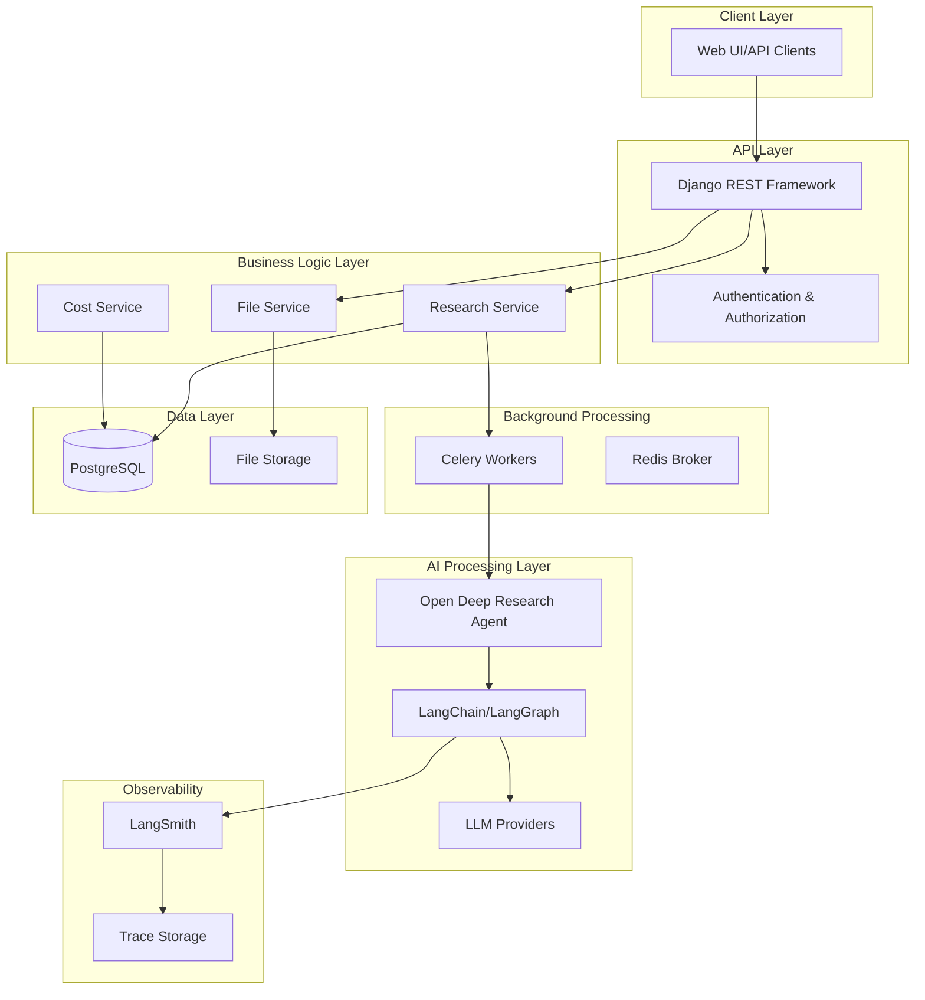
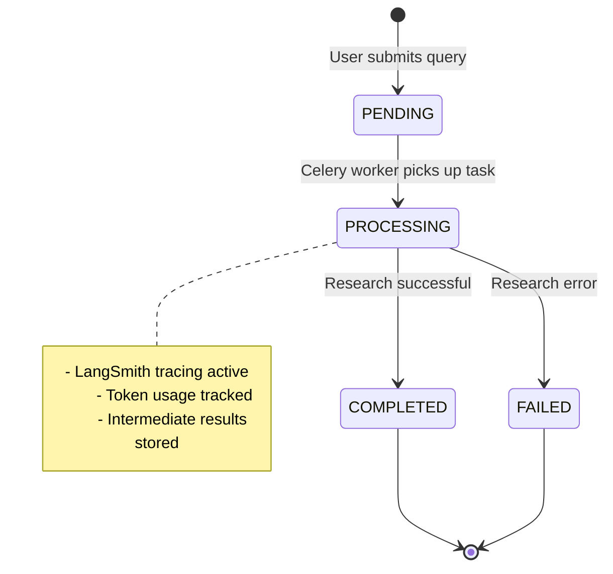
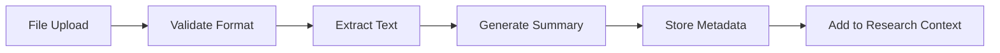

# Design Document: AI Research System

## Overview

The AI Research System is a Django-based web application that provides persistent, observable, and cost-aware deep research capabilities. The system integrates with the existing [langchain-ai/open_deep_research](https://github.com/langchain-ai/open_deep_research) repository to leverage proven multi-step AI research workflows while adding enterprise-grade persistence, observability, and cost tracking features.

The architecture follows a layered approach with Django REST Framework handling API operations, PostgreSQL managing data persistence, and LangChain/LangGraph orchestrating AI workflows. Background task processing ensures research operations don't block user interactions, while LangSmith provides comprehensive observability and cost tracking.

## Architecture

### System Components



### Data Flow

1. **Research Initiation**: User submits research query via API
2. **Task Queuing**: Research request queued for background processing
3. **AI Processing**: Open Deep Research agent executes multi-step workflow
4. **Observability**: LangSmith captures traces, tokens, and costs
5. **Persistence**: Results, metadata, and costs stored in PostgreSQL
6. **Continuation**: Previous research context injected into new sessions

## Components and Interfaces

### Django Models

**ResearchSession Model**
```python
class ResearchSession(models.Model):
    id = models.UUIDField(primary_key=True, default=uuid.uuid4)
    user_id = models.CharField(max_length=255)
    query = models.TextField()
    status = models.CharField(max_length=20, choices=STATUS_CHOICES)
    report = models.JSONField(null=True, blank=True)
    summary = models.TextField(blank=True)
    reasoning = models.JSONField(null=True, blank=True)
    parent_session = models.ForeignKey('self', null=True, blank=True)
    langsmith_trace_id = models.CharField(max_length=255, null=True)
    created_at = models.DateTimeField(auto_now_add=True)
    completed_at = models.DateTimeField(null=True, blank=True)
```

**ResearchFile Model**
```python
class ResearchFile(models.Model):
    id = models.UUIDField(primary_key=True, default=uuid.uuid4)
    session = models.ForeignKey(ResearchSession, related_name='files')
    filename = models.CharField(max_length=255)
    file_type = models.CharField(max_length=10)
    content_summary = models.TextField()
    file_path = models.CharField(max_length=500)
    uploaded_at = models.DateTimeField(auto_now_add=True)
```

**ResearchCost Model**
```python
class ResearchCost(models.Model):
    session = models.OneToOneField(ResearchSession, related_name='cost')
    input_tokens = models.IntegerField(default=0)
    output_tokens = models.IntegerField(default=0)
    total_tokens = models.IntegerField(default=0)
    estimated_cost = models.DecimalField(max_digits=10, decimal_places=4)
    provider_costs = models.JSONField(default=dict)
    created_at = models.DateTimeField(auto_now_add=True)
```

### API Endpoints

**Research Management**
- `POST /api/research/` - Start new research session
- `GET /api/research/` - List user's research sessions
- `GET /api/research/{id}/` - Get specific research details
- `POST /api/research/{id}/continue/` - Continue previous research
- `GET /api/research/{id}/status/` - Get research status

**File Management**
- `POST /api/research/{id}/files/` - Upload files for research context
- `GET /api/research/{id}/files/` - List session files
- `DELETE /api/research/{id}/files/{file_id}/` - Remove file

**Cost Tracking**
- `GET /api/research/{id}/cost/` - Get research cost details
- `GET /api/users/{user_id}/costs/` - Get user's total costs

### Service Layer

**ResearchService**
```python
class ResearchService:
    def start_research(self, user_id: str, query: str, files: List[File] = None, parent_id: str = None) -> ResearchSession
    def get_research_status(self, session_id: str) -> Dict
    def get_user_research_history(self, user_id: str) -> List[ResearchSession]
    def continue_research(self, parent_id: str, new_query: str) -> ResearchSession
```

**FileService**
```python
class FileService:
    def process_uploaded_file(self, file: File, session_id: str) -> ResearchFile
    def extract_text_content(self, file_path: str, file_type: str) -> str
    def generate_content_summary(self, content: str) -> str
```

**CostTrackingService**
```python
class CostTrackingService:
    def track_research_costs(self, trace_id: str, session_id: str) -> ResearchCost
    def calculate_estimated_cost(self, token_usage: Dict) -> Decimal
    def get_user_total_costs(self, user_id: str, period: str) -> Dict
```

## Data Models

### Research Session Lifecycle



### File Processing Pipeline



### Research Continuation Model

Research sessions can reference parent sessions to build on previous findings:
- **Parent Context**: Previous research summary injected into new session
- **Lineage Tracking**: Maintains parent-child relationships
- **Deduplication**: Avoids repeating previously covered topics
- **Context Limits**: Manages context window size for LLM processing

## Correctness Properties

*A property is a characteristic or behavior that should hold true across all valid executions of a system—essentially, a formal statement about what the system should do. Properties serve as the bridge between human-readable specifications and machine-verifiable correctness guarantees.*

### Property 1: Research Workflow Execution
*For any* valid research query submitted by a user, the system should execute the Open Deep Research workflow asynchronously and generate a structured report with sources and findings upon successful completion.
**Validates: Requirements 1.1, 1.2, 1.3**

### Property 2: Research Error Handling
*For any* research session that encounters an error during execution, the system should capture error details, update the session status appropriately, and provide meaningful error information to the user.
**Validates: Requirements 1.4**

### Property 3: Complete Data Persistence
*For any* completed research session, the system should store all required metadata including user_id, query, report, summary, status, timestamps, reasoning, and cost data in the database.
**Validates: Requirements 2.1, 2.4, 5.3, 7.3**

### Property 4: User Data Isolation
*For any* user requesting their research history or attempting to continue a research session, the system should only return or allow access to research sessions that belong to that specific user.
**Validates: Requirements 2.2, 3.4**

### Property 5: Data Integrity Preservation
*For any* research session stored in the database, retrieving that session should return exactly the same data that was originally stored, ensuring no data loss or corruption.
**Validates: Requirements 2.3**

### Property 6: Research Continuation Context Injection
*For any* research continuation request with a valid parent session ID, the system should inject the parent session's summary into the new research context and establish the correct parent-child relationship.
**Validates: Requirements 3.1, 3.3**

### Property 7: Research Deduplication
*For any* research continuation session, the system should include previous research context in a way that enables the AI agent to avoid repeating previously covered topics.
**Validates: Requirements 3.2**

### Property 8: File Processing and Integration
*For any* PDF or TXT file uploaded to a research session, the system should extract text content, generate a summary, store the file metadata, and make the content available for research context.
**Validates: Requirements 4.1, 4.2, 4.4**

### Property 9: File Content Research Integration
*For any* research session with uploaded files, the research results should reflect or incorporate information from the uploaded file content.
**Validates: Requirements 4.3**

### Property 10: Reasoning Visibility and Security
*For any* completed research session, the system should provide summarized reasoning information while ensuring that raw chain-of-thought or internal agent communications are not exposed to users.
**Validates: Requirements 5.1, 5.2, 5.4**

### Property 11: LangSmith Tracing Integration
*For any* research session execution, the system should create a unique LangSmith trace, store the trace ID in the database, and ensure the trace captures all LLM calls and tool executions.
**Validates: Requirements 6.1, 6.2, 6.3, 6.4**

### Property 12: Comprehensive Cost Tracking
*For any* research session, the system should track input and output tokens for all LLM calls, calculate estimated costs, and return this information when research details are requested.
**Validates: Requirements 7.1, 7.2, 7.4**

## Error Handling

### Research Execution Errors
- **LLM API Failures**: Retry logic with exponential backoff, fallback to alternative providers
- **Network Timeouts**: Configurable timeout settings, graceful degradation
- **Invalid Queries**: Input validation and sanitization before processing
- **Resource Limits**: Memory and processing time limits to prevent runaway operations

### File Processing Errors
- **Unsupported Formats**: Clear error messages for invalid file types
- **Corrupted Files**: Validation and error handling for damaged uploads
- **Size Limits**: Configurable file size restrictions with user feedback
- **Extraction Failures**: Fallback mechanisms for text extraction issues

### Database Errors
- **Connection Failures**: Connection pooling and retry mechanisms
- **Transaction Rollbacks**: Atomic operations for data consistency
- **Constraint Violations**: Proper validation before database operations
- **Migration Issues**: Comprehensive database migration testing

### Background Task Errors
- **Celery Worker Failures**: Task retry policies and dead letter queues
- **Queue Overflow**: Monitoring and alerting for task queue health
- **Task Timeouts**: Configurable timeout settings for long-running operations
- **Result Backend Issues**: Robust result storage and retrieval mechanisms

## Testing Strategy

### Dual Testing Approach
The system requires both unit testing and property-based testing to ensure comprehensive coverage:

**Unit Tests**: Verify specific examples, edge cases, and error conditions
- Django model validation and constraints
- API endpoint responses and status codes
- File upload and processing edge cases
- Authentication and authorization scenarios
- Database transaction handling
- Celery task execution and error handling

**Property-Based Tests**: Verify universal properties across all inputs
- Research workflow execution with random queries
- Data persistence and retrieval consistency
- User isolation across different user scenarios
- File processing with various file types and sizes
- Cost calculation accuracy with different token usage patterns
- LangSmith tracing completeness across research sessions

### Property-Based Testing Configuration
- **Testing Framework**: Use Hypothesis for Python property-based testing
- **Test Iterations**: Minimum 100 iterations per property test to ensure comprehensive coverage
- **Test Tagging**: Each property test tagged with format: **Feature: ai-research-system, Property {number}: {property_text}**
- **Integration**: Property tests integrated into Django test suite using pytest

### Testing Environment
- **Test Database**: Isolated PostgreSQL test database for each test run
- **Mock Services**: Mock LangSmith and LLM providers for deterministic testing
- **File Fixtures**: Standardized test files for upload and processing scenarios
- **Background Tasks**: Synchronous task execution in test environment

### Coverage Requirements
- **Code Coverage**: Minimum 90% line coverage for all business logic
- **Property Coverage**: Each correctness property must have corresponding property-based test
- **Integration Coverage**: End-to-end tests for critical user workflows
- **Performance Testing**: Load testing for concurrent research sessions and file uploads